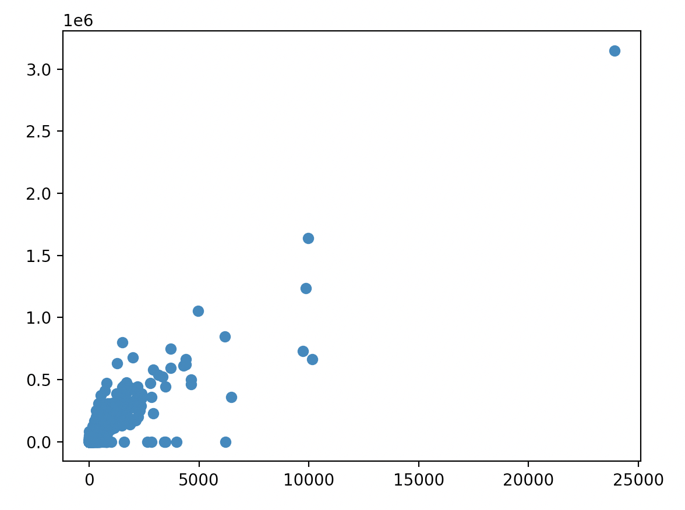
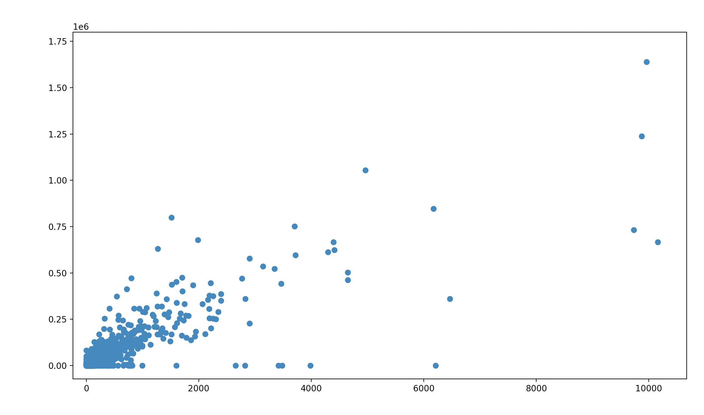
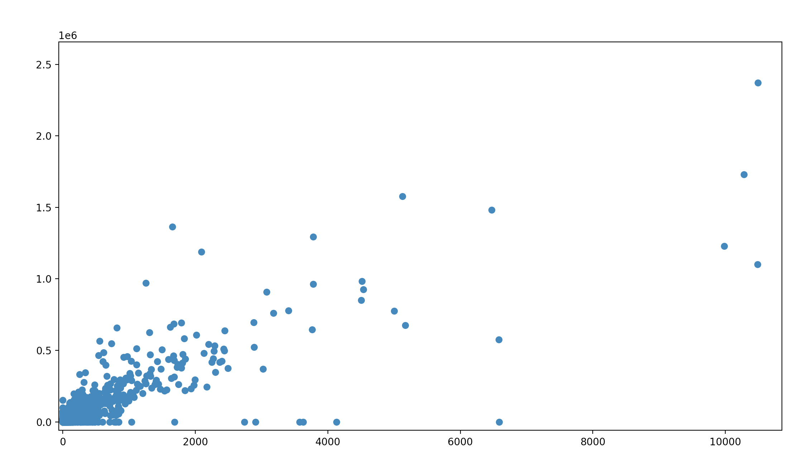
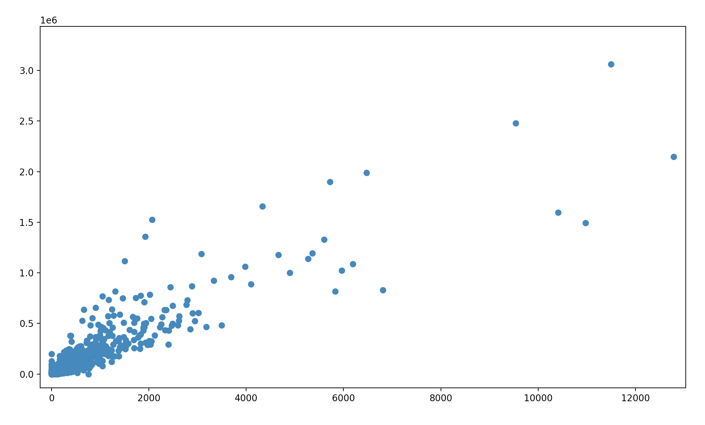

# vaccines

Collaborative project to investigate vaccine effectiveness

## CDC data

Download and compress the CDC vaccination data. See Makefile for details (credit to Philip for the makefile).

```
make cdcdata
```

## JHU data

Please refer to this file for a Python script that downloads the JHU data and makes a csv (credit to Bridget for this file).

```
bridget_JHU_merge.py
```

## Processing and visualization

Please refer to this file for a Python script that process the data, cleans it, and generates 3 scatterplots. 

```
vaccine_data_total.py
```

## Results

When you generate a plot using 05/01/2021 as the date, the script shows this plot:



Clearly there is some kind of an outlier here, but if we look closer at the cluster of points we get this:



Running the script again at July 1 21:



And November 30 21:



The plots represent vaccinated population over 18 on the Y axis and deaths due to COVID on the x axis. Each point is a county (FIPS code). You would expect that over time, the points would move towards the bottom left corner (more people get vaccinated and less people dying). The results do seem to show this trend a little bit, but they also just generally show a clustering of points (points are moving closer together). Based on these results, I am wondering If I missed a step somewhere in the data procssing peice because of the outlier.

I learned how to work with data csv files, combine them, clean them, and start to visualize them. I think it is important to have a very clear end goal in mind and be framiliar with the data in order to know what to expect (what columns you need, what challenges there will be on the cleaning side). I am still not sure that the FIPS code matched up perfectly or how to check this. It seemed like it worked, but I want to learn more on how to verify this.
