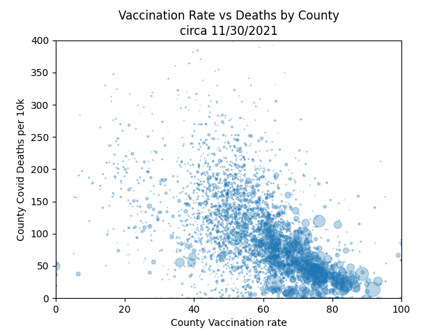
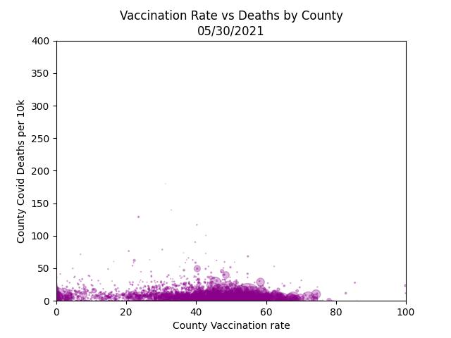
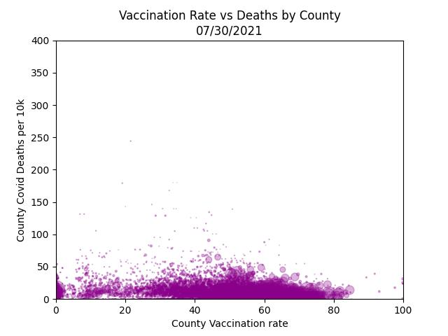
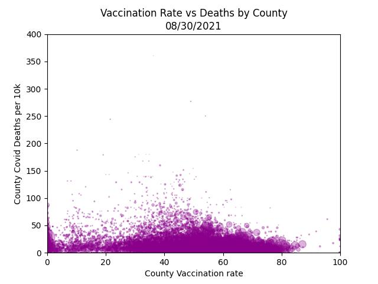
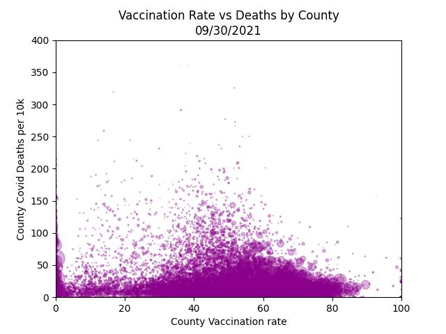
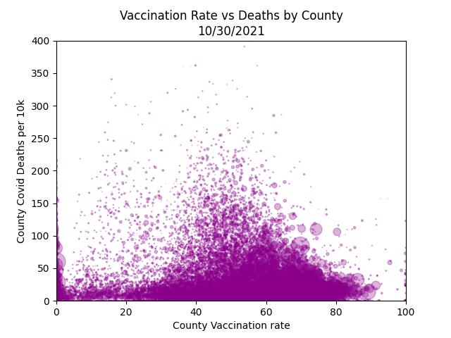
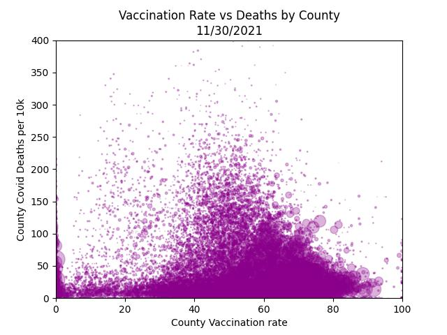

# Assignment 5
The goal of assignment 5 is to explore the relationship between datasets of COVID-19 vaccination rates and COVID-19-related death rates. 

To graph a scatterplot of death rates by vaccination rates:
```
make cdc
make single_plot
```

To graph a series of scatterplot of death rates by vaccination rates changing over time:
```
make cdc
make time_plot
```
***
## About the vaccine data
We are working with vaccination data from the CDC, which breaks out vaccination figures by county among the general population, the age groups 5+, 18+, and 65+. Within the rate of vaccination for each of these groups, which 

## About the deaths data
The CDC also provides data on death rates, however this project uses data from Johns Hopkins University's CSSE Github. This repo contains daily reports for regions in the US and globally, focused on rates of infection and mortality.

***
## How to use this repo


`make cdcdata` will pull the CDC COVID-19 vaccination dataset (~240MB) from their website and compress the file with gzip (~80MB)  

`make single_plot` should output the scatterplot shown below:



`make time_plot` should output each of the plots shown below:

    
  
  