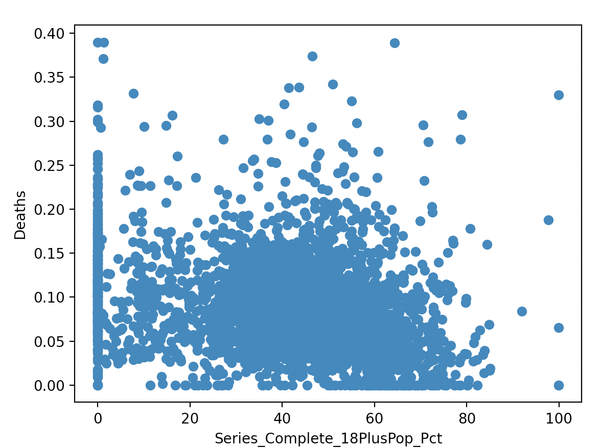

# vaccines

This branch contains one option to investigate vaccine effectiveness (part of a collaborative project). To run this project, you will need to download the CDC data, and the JHU data to start. Details are below.

## CDC data

Download and compress the CDC vaccination data. See Makefile for details (credit to Philip for the makefile).

```
make cdcdata
```

## JHU data

Please refer to this file for a Python script that downloads the JHU data and makes a csv (credit to Bridget for this file).

```
bridget_JHU_merge.py
```

## About the data

The CDC data set contains information regarding COVID-19 vaccination rates at the county level in the USA. For the purposes of this project, we will focus on the Date, FIPS code (county code), Series_Complete_18PlusPop_Pct (Percent of people 18+ who are fully vaccinated), and Census2019_18PlusPop. Depending on your goals, you might want to bring in different columns (which the code allows for). You could look at the entire population, 65+ etc. Given that only 18+ year olds are allowed to be vaccinated at May 1 2021 (when this analysis beings) it makes sense to use the 18+ cutoff point. Please refer to the [CDC website](https://data.cdc.gov/Vaccinations/COVID-19-Vaccinations-in-the-United-States-County/8xkx-amqh) for more information about the raw data.

The JHU data set contains information regarding the COVID-19 mortality rate at the county level in the USA. For the purposes of this project, we will focus on the Date, FIPS code (county code), and Deaths columns. Once again, depending on your goals, you also might want to focus on different columns. But for this analysis, we want to understand the relationship between the Deaths information from JHU and the Series_Complete_18PlusPop_Pct information from the CDC data. Please refer to the [JHU GitRepo](https://github.com/CSSEGISandData/COVID-19) for more information about the raw data.

## Processing and visualization

Please refer to this file for a Python script that process the data, cleans it, and generates 3 scatterplots. 

```
vaccine_effectiveness_final.py
```

## Results

When you generate a plot using 05/01/2021 as the date, the script shows this plot:


Running the script again at Aug 1 21:



And November 30 21:


The plots represent vaccinated population over 18 percentage on the X axis and deaths due to COVID on the Y axis. Each point is a county (FIPS code). We can clearly see that as time goes on, the population overall becomes more vaccinated. However, the deaths do not appear to be changing all that much. This could be for a variety of reasons. Perhaps the vaccine is not as effective at protecting against later variants like delta and omicron. 

## To Recreate these Results

To recreate these plots simply run the command:

```
make cdcdata
```
To download the CDC data.

Then run the command:

```
bridget_JHU_merge.py
```
To download the JHU data.

Finally run the command:
```
python vaccine_effectiveness_final.py
``` 
To process the data and generate the plots.

## References
Data: 
[CDC website](https://data.cdc.gov/Vaccinations/COVID-19-Vaccinations-in-the-United-States-County/8xkx-amqh) for more information about the raw data.
[JHU GitRepo](https://github.com/CSSEGISandData/COVID-19)

This branch was developed as part of a collaborative project. Please see 

```
vaccine_effectiveness_final.py
```
for more information on specific references for the code. 


