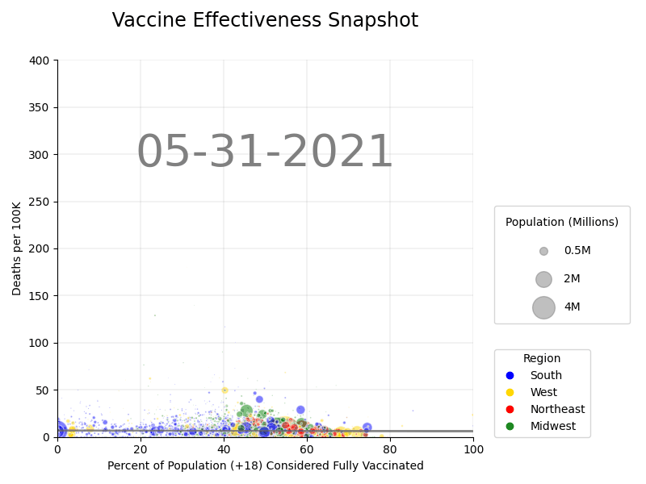

# Exploring COVID-19 Vaccine Effectiveness
## National View


## County View


## Overview 
This analysis aims to explore the relationship between Covid-19 vaccinations and deaths attributed to Covid-19 in the U.S. between 5/31/21 - 11/30/21 to analyze the effectiveness of the Covid-19 vaccination over time.  

These dates represent the time period between when vaccines became broadly available in Spring 2021 and the emergence of the omicron variant in late November 2021.

## Data

Data related to the Covid-19 vaccination was sourced from the Center For Disease Control and Prevention (CDC) and data related to Covid-19 deaths was sourced from Johns Hopkins University (JHU). Data in this repo was accessed on Sunday, March 27 2022. 

To begin to assess the effectiveness of the vaccination over time, the % of the vaccinated population over 18 years of age (CDC) is compared to Covid related deaths per 100k (JHU). The data was broken down by U.S. region (West, Midwest, South, Northeast) based on the [Census Bureau regional divisions](https://www2.census.gov/geo/pdfs/maps-data/maps/reference/us_regdiv.pdf), and a snapshot was of data was taken at the of each month to create a more accurate representation. Because the JHU data reflect deaths that accumulate over time, the time series was adjusted to compute the difference in death figures between dates.  

Links to the data sources are cited below, but this repo contains a 'source of truth' set of data for reproducibility. 

**CDC Data**
```
https://data.cdc.gov/Vaccinations/COVID-19-Vaccinations-in-the-United-States-County/8xkx-amqh
``` 

**Johns Hopkins University Data**
```
https://github.com/CSSEGISandData/COVID-19/tree/f57525e860010f6c5c0c103fd97e2e7282b480c8
```
## Cleaning and linking the data
The CDC data is made available as a single file, updated daily by the CDC since May 24, 2021 (the file contains data about vaccinations beginning in December 2020, though). The JHU data is released daily as well, but each file contains a snapshot of one specific day. Both sources include FIPS codes--when combined with the date information, we can link datasets together to explore our research question.  

Because of the May-November timeframe we wanted to analyze, we focused on data for seven specific dates:
* May 31, 2021
* June 30, 2021
* July 31, 2021
* August 31, 2021
* September 30, 2021
* October 31, 2021
* November 30, 2021

Here are the steps our team took:
1. Wrote code that downloads and compresses the CDC data
1. Wrote code that samples the CDC data for specifc dates and columns (noted below), and returned separate .csv files for each selected date:
* FIPS *(unique five-digit identifier for each US county)*
* Recip_County *(name of the county)*
* Recip_State *(name of the state)*
* Series_Complete_18PlusPop_Pct *(percentage of 18+ year old population in that county that is fully vaccinated on that date)*
* Census2019_18PlusPop *(the 2019 US Census population of that county)*
1. Wrote code that downloads selected dates from JHU data, calculates the cumulative number of deaths in the timespan from May 1, 2021 through the selected date, and returns a .csv file 
1. Wrote code that merges those two sets of data, resulting in seven snapshots of vaccination and death rate data for each county in the US captured in .csv files

The user can examine these files in the **data** directory. 


## Running The Code 

A [Makefile](./Makefile) has been created to streamline code compilation. To execute, clone the vaccines repository to your local drive & run the makefile outlined below.

1. Create a time series of scatter plots and save .png files to the 'img' directory
```bash
make scatters
```
2. Generate an animation using the plots generated above
```bash
make animation
```
3. Start a basic python development server to view the docs on a local machine
```bash
make serve
```

Additionally, the make file allows you to download the data, merge the files, plot the data and create the GIF with one command by running ```make all```

## Output
Assuming all is well, the output should look something like this:

and this:


## Analysis - National View
The proportion of the population that is vaccinated increases over the time frame, which you can see as the bubbles move from left to right. The quantity of deaths increases as well month-by-month, which makes sense: more deaths accumulate each month while the denominator (the 2019 Census population) stays the same. We also know that the Delta variant hit during this time period, which was much more contagious than previous strains: we should expect deaths to increase.  
  
However, consider the trajectories of the large bubbles (representing highly populous counties) vs. their smaller counterparts. The largest bubbles progress steadily into the 70-80% vaccinated range by the end of the timeframe, and their rate of deaths generally tops out at 100 deaths/100K people. Many smaller bubbles struggle to reach the 50% vaccinated mark, and several of their death rates soar into the 300-400 deaths/100K range. Comparing these two groups suggest that vaccination is highly effective--otherwise the more highly-populated areas would likely have similar (or even worse) death rates, given the physical proximity of the population in these urban centers.   
  
Regional differences prove to be fertile ground for continued research. Many of the small blue dots, representing counties in the South, don't reach the 50% vaccinated threshold. However, the large blue bubbles (representing urban areas in the South) follow a more direct left-to-right trajectory--and tellingly, keep their death rates low.  
  
These findings suggest that behavioral differences rural vs. urban communities (mask wearing, social distancing, etc.) or differences in political ideology may affect vaccine adoption--but they offer little doubt that the COVID vaccines are effective at minimizing the death toll of the virus. 
  
## Analysis - County View
This visualization shows a county-level comparison between Kent County, RI and Tuscaloosa County, AL.

The team selected Kent County and Tuscaloosa County due to their similar population demographics, but highly different rates of vaccination to see the impact (if any) on death rates due to COVID-19. 

The visualization indicates a very noticeable difference between the number of deaths in a county with high vaccination rates (Kent, RI) and the number of deaths in a county with low vaccination rates (Tuscaloosa, AL). It is important to note that this analysis only compares two specific counties and does not take into consideration other relevant factors such as mask wearing and social distancing. However, it is still interesting to see that the conclusion from the analysis of all U.S. counties is the same as the analysis from individual county perspective.

## Acknowledgements

The inspiration to visualize vaccine rate v death rate for this project came from the following NPR article: [Pro-Trump counties now have far higher COVID death rates. Misinformation is to blame.](https://www.npr.org/sections/health-shots/2021/12/05/1059828993/data-vaccine-misinformation-trump-counties-covid-death-rate)

## Future Considerations

**Dataset**  
  * Compare individual areas with higher vaccination rates against similar areas with lower vaccination rates
  * Subset data to explore effectiveness across different age ranges 
  * Segment date ranges and countes to align with peaks and valleys in Covid spread

**Code**  
  * Explore the use of different chart types (map, bar chart, line graph)

### Contributors


[Philip Bogden](https://github.com/pbogden) | [Sophia Cofone](https://github.com/sophiacofone) | [Qiwei "Jerry" Hu](https://github.com/JerryV77) |
[Connor Lynch](https://github.com/CCLynch) | [Philip Mathieu](https://github.com/PhilipMathieu) | [Bridget Mohler](https://github.com/b-mohler) |
[Matthew Ray](https://github.com/MatthewjRay) | [Kayne Ryan](https://github.com/kayneryan) | [Zheng Yune](https://github.com/zyune) |
