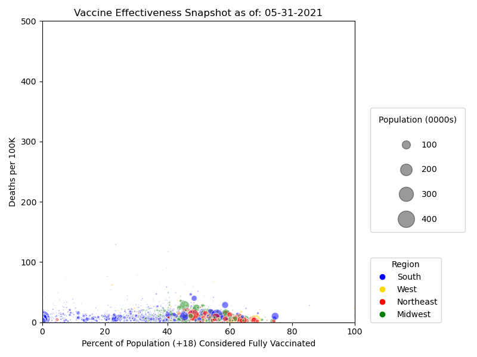

# Exploring COVID-19 Vaccine Effectiveness



## Overview 
This analysis aims to explore the relationship between Covid-19 vaccinations and deaths attributed to Covid-19 in the U.S. between 5/31/21 - 11/30/21 to analyze the effectiveness of the Covid-19 vaccination over time.

## Data

Data related to the Covid-19 vaccination was sourced from the Center For Disease Control and Prevention (CDC) and data related to Covid-19 deaths was sourced from Johns Hopkins University (JHU).

To begin to assess the effectiveness of the vaccination over time, the % of the vaccinated population over 18 years of age (CDC) is compared to Covid related deaths per 100k (JHU). The data was broken down by U.S. region (West, Midwest, South, Northeast) based on the [Census Bureau regional divisions](https://www2.census.gov/geo/pdfs/maps-data/maps/reference/us_regdiv.pdf), and a snapshot was of data was taken at the of each month to create a more accurate representation. Because the JHU cumulates deaths, the time series was adjusted to compute the difference in death figures between dates. 

**CDC Data**
```
https://data.cdc.gov/Vaccinations/COVID-19-Vaccinations-in-the-United-States-County/8xkx-amqh
```

**Johns Hopkins University Data**
```
https://github.com/CSSEGISandData/COVID-19/tree/f57525e860010f6c5c0c103fd97e2e7282b480c8
```

## Running The Code 

A [Makefile](./Makefile) has been created to streamline code compilation. To execute, clone the vaccines repository to your local drive & run the makefile outlined below.

_Note: If you would prefer to skip steps 1-5 (saving time but not directly accessing the authoritative data sources), clone the ```main_with_data``` branch._

1. Create a data directory:
```
make data
```
2. Download and compress the CDC data.
```
make cdc
```
3. Create a CSV file with sampled CDC data.
```
make vaccines
```
4. Download deaths data from JHU and create CSV files

```
make deaths
```
5. Merge the CDC vaccination dataset with the JHU deaths dataset and clean the dataset to remove non U.S. data.
```
make merge
```
6. Create a time series of scatter plots and save .png files to the 'img' directory
```
make scatters
```
7. Generate an animation using the plots generated above
```
make animation
```

Additionally, the make file allows you to:
* Do all of the above with one command by running ```make all```
* Create a single scatter plot for EDA purposes with ```make test```
* Delete the data and img directories to start fresh with ```make clean```


## Output
Assuming all is well, the output should look something like this:


## Analysis


The proportion of the population that is vaccinated increases over the time frame, which you can see as the bubbles move from left to right. The quantity of deaths increases as well month-by-month, which makes sense: more deaths accumulate each month while the denominator (the 2019 Census population) stays the same. We also know that the Delta variant hit during this time period, which was much more contagious than previous strains: we should expect deaths to increase.  
  
However, consider the trajectories of the large bubbles (representing highly populous counties) vs. their smaller counterparts. The largest bubbles progress steadily into the 70-80% vaccinated range by the end of the timeframe, and their rate of deaths generally tops out at 100 deaths/100K people. Many smaller bubbles struggle to reach the 50% vaccinated mark, and several of their death rates soar into the 300-400 deaths/100K range. Comparing these two groups suggest that vaccination is highly effective--otherwise the more highly-populated areas would likely have similar (or even worse) death rates, given the physical proximity of the population in these urban centers.   
  
Regional differences prove to be fertile ground for continued research. Many of the small blue dots, representing counties in the South, don't reach the 50% vaccinated threshold. However, the large blue bubbles (representing urban areas in the South) follow a more direct left-to-right trajectory--and tellingly, keep their death rates low.  
  
These findings suggest that behavioral differences in rural vs. urban communities (mask wearing, social distancing, etc.) or differences in political ideology may affect vaccine adoption--but they offer little doubt that the COVID vaccines are effective at minimizing the death toll of the virus. 
  
## Future Considerations

**Dataset**  
  * Compare different regions with similar population sizes 
  * Compare individual areas with higher vaccination rates against similar areas with lower vaccination rates
  * Subset data to explore effectiveness across different age ranges 
  * Segment date ranges and countes to align with peaks and valleys in Covid spread

**Code**  
  * Add regression line to better visualize trends in data
  * Explore the use of different chart types (map, bar chart, line graph)

### Contributors


[Philip Bogden](https://github.com/pbogden) | [Sophia Cofone](https://github.com/sophiacofone) | [Qiwei "Jerry" Hu](https://github.com/JerryV77) |
[Connor Lynch](https://github.com/CCLynch) | [Philip Mathieu](https://github.com/PhilipMathieu) | [Bridget Mohler](https://github.com/b-mohler) |
[Matthew Ray](https://github.com/MatthewjRay) | [Kayne Ryan](https://github.com/kayneryan) | [Zeng Yune](https://github.com/zyune) |
